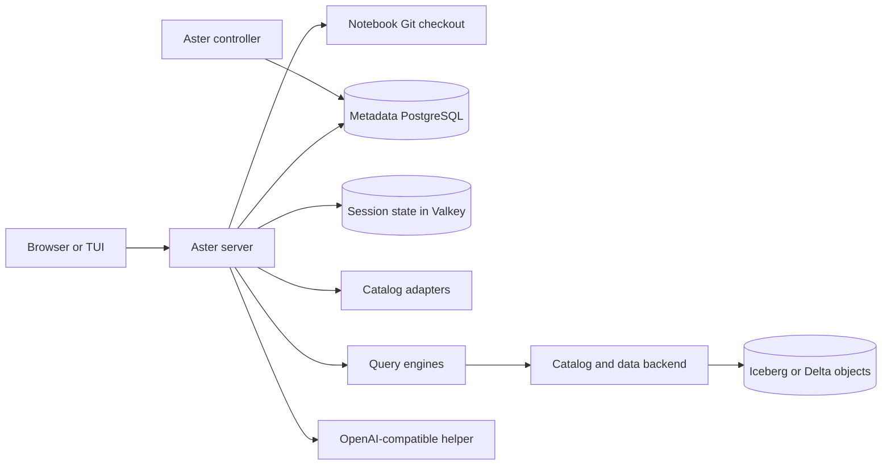

# Architecture and state

Aster has a Rust domain crate, adapters for engines and catalogs, an Axum server,
a metadata controller, and a terminal client. The browser and TUI use the
server; [the proto](../proto/aster.proto) declares the gRPC/Connect methods.
Some older browser and TUI calls still use `/api/*` handlers.

The last two nodes belong to the data platform reached by an engine. Aster
does not store table objects. In the disposable local stack, Polaris registers
Iceberg metadata and RustFS holds object data; Trino and Spark connect to that
stack. Aster's catalog adapter browses metadata. It does not sit in the SQL
execution path or grant table access.

| State | Owner and durability |
|---|---|
| Notebook cells | Text `.aster` files and commits in `ASTER_NOTEBOOK_DIR`. The local checkout is the only implemented Git backend; it does not push to GitHub. |
| Grants, audit, legacy notebook owner records, personal helper registrations, opt-in encrypted admin shared registrations and default conversation history | Metadata PostgreSQL when `DATABASE_URL` is set; otherwise process memory. Shared registrations need a separate application keyset to remain decryptable. |
| Delegated conversation history | A separate PostgreSQL database when `ASTER_CONVERSATION_DATABASE_URL` selects it. Changing databases does not move old history. |
| Sessions, login handshakes and working state | Valkey when `ASTER_STATE_URL` is set; otherwise process memory. |
| Data contracts | Files read from `ASTER_CONTRACTS_DIR` at server startup. They are deployment artifacts, not a user-editable metadata store. |

The server selects providers centrally in
[`providers.rs`](../crates/server/src/providers.rs), and rejects unknown provider
names at startup. [The provider matrix](provider-matrix.md) records the core
ports and implementation choices. The controller mirrors engine/catalog health
and prunes audit rows; it requires `DATABASE_URL`. PostgreSQL migrations are
idempotent scripts run at startup, including conversation, notebook-owner and
shared-model tables.

For a query, the server authenticates the caller, checks the app role and
engine grant, calls the selected engine and writes an audit event. The engine's
catalog connector and data credentials determine what table data can actually
be read. Application catalog/engine admission is implemented; per-user backend
identity remains planned. See [catalogs and compute](catalogs-and-compute.md).
